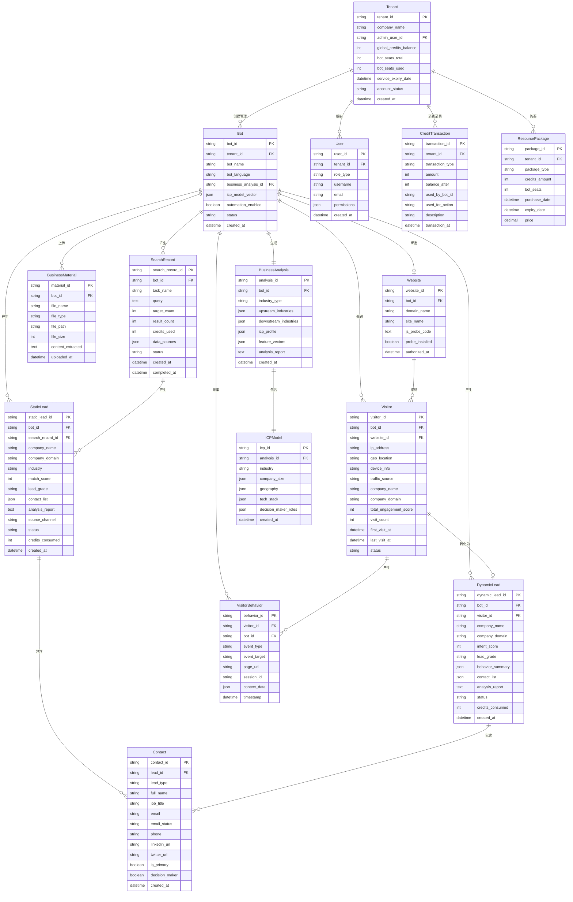

# 实体关系设计

> **最后更新**：2026-04-20  
> **关联文档**：[01-概念设计](01-概念设计.md)、[05-业务流设计](05-业务流设计.md)

---

## 核心实体定义

### 租户 (Tenant)

**定义**：核心实体，代表一个企业客户账号，管理全局资源池和BOT席位。

**核心属性**：
| 属性名 | 类型 | 说明 | 示例值 |
|--------|------|------|--------|
| tenant_id | string | 租户唯一标识 | "TEN-001" |
| company_name | string | 公司名称 | "ABC Trading Co." |
| admin_user_id | string | 管理员用户ID | "USR-001" |
| global_credits_balance | int | 全局积分余额 | 5000 |
| bot_seats_total | int | BOT席位总数 | 3 |
| bot_seats_used | int | 已使用BOT席位 | 2 |
| service_expiry_date | datetime | 服务到期日期 | 2026-12-31 |
| account_status | string | 账号状态 | active/frozen/expired |
| created_at | datetime | 创建时间 | 2026-01-15 |

**生命周期**：
- 创建条件：企业注册并完成认证
- 状态变化：正常 → 欠费冻结 → 续费恢复 → 到期归档
- 销毁条件：账号注销后保留90天归档

---

### BOT (获客服务BOT)

**定义**：业务隔离单元，每个BOT对应一个独立站或业务线的获客引擎实例。

**核心属性**：
| 属性名 | 类型 | 说明 | 示例值 |
|--------|------|------|--------|
| bot_id | string | BOT唯一标识 | "BOT-001" |
| tenant_id | string | 所属租户ID | "TEN-001" |
| bot_name | string | BOT名称 | "Main Website Bot" |
| bot_language | string | BOT语言 | en/zh/es |
| business_analysis_id | string | 业务分析报告ID | "ANL-001" |
| icp_model_vector | json | ICP模型向量 | {...} |
| automation_enabled | boolean | 是否启用自动化 | true/false |
| status | string | BOT状态 | active/paused/deleted |
| created_at | datetime | 创建时间 | 2026-01-15 |

**生命周期**：
- 创建条件：租户创建BOT并分配席位
- 状态变化：创建 → 业务建模 → 运行中 → 暂停/删除
- 销毁条件：删除后保留30天归档

---

### 业务分析 (BusinessAnalysis)

**定义**：AI生成的业务分析报告，包含行业定位、ICP画像、特征向量等。

**核心属性**：
| 属性名 | 类型 | 说明 | 示例值 |
|--------|------|------|--------|
| analysis_id | string | 分析ID | "ANL-001" |
| bot_id | string | 所属BOT ID | "BOT-001" |
| industry_type | string | 行业类型 | "Manufacturing" |
| upstream_industries | json | 上游行业 | ["Raw Materials", "Components"] |
| downstream_industries | json | 下游行业 | ["Retail", "Distribution"] |
| icp_profile | json | ICP画像 | {...} |
| feature_vectors | json | 特征向量 | [...] |
| analysis_report | text | 分析报告内容 | "..." |
| created_at | datetime | 创建时间 | 2026-01-15 |

**生命周期**：
- 创建条件：BOT上传业务材料或授权独立站后触发AI分析
- 状态变化：分析中 → 完成
- 销毁条件：随BOT删除而删除

---

### ICP模型 (ICPModel)

**定义**：理想客户画像模型。

**核心属性**：
| 属性名 | 类型 | 说明 | 示例值 |
|--------|------|------|--------|
| icp_id | string | ICP ID | "ICP-001" |
| analysis_id | string | 所属分析ID | "ANL-001" |
| industry | string | 行业 | "Electronics" |
| company_size | json | 企业规模 | {"min": 50, "max": 500} |
| geography | json | 地理范围 | ["North America", "Europe"] |
| tech_stack | json | 技术栈 | ["Shopify", "Salesforce"] |
| decision_maker_roles | json | 决策人角色 | ["CEO", "Procurement Manager"] |
| created_at | datetime | 创建时间 | 2026-01-15 |

**生命周期**：
- 创建条件：业务分析完成后自动生成
- 状态变化：创建 → 应用 → 更新
- 销毁条件：随业务分析更新而替换

---

### 搜客记录 (SearchRecord)

**定义**：搜客任务记录，追踪每次搜客的需求、消耗和结果。

**核心属性**：
| 属性名 | 类型 | 说明 | 示例值 |
|--------|------|------|--------|
| search_record_id | string | 搜客记录ID | "SRC-001" |
| bot_id | string | 所属BOT ID | "BOT-001" |
| task_name | string | 任务名称 | "Q1 Europe Search" |
| query | text | 搜客需求描述 | "Find electronics manufacturers in Germany" |
| target_count | int | 目标数量 | 100 |
| result_count | int | 结果数量 | 85 |
| credits_used | int | 消耗积分 | 250 |
| data_sources | json | 数据源配置 | ["customs", "linkedin"] |
| status | string | 任务状态 | pending/running/completed/failed |
| created_at | datetime | 创建时间 | 2026-01-15 |
| completed_at | datetime | 完成时间 | 2026-01-15 |

**生命周期**：
- 创建条件：用户提交搜客需求并确认
- 状态变化：待执行 → 执行中 → 完成/失败
- 销毁条件：保留90天后归档

---

### 静态线索 (StaticLead)

**定义**：通过全网搜客获取的潜在客户线索，来源于海关数据、社媒数据等。

**核心属性**：
| 属性名 | 类型 | 说明 | 示例值 |
|--------|------|------|--------|
| static_lead_id | string | 静态线索ID | "STL-001" |
| bot_id | string | 所属BOT ID | "BOT-001" |
| search_record_id | string | 来源搜客记录ID | "SRC-001" |
| company_name | string | 公司名称 | "XYZ Manufacturing" |
| company_domain | string | 公司域名 | "xyz-mfg.com" |
| industry | string | 行业 | "Electronics" |
| match_score | int | 匹配分数 | 85 |
| lead_grade | string | 线索等级 | A/B/C/D |
| contact_list | json | 联系人列表 | [...] |
| analysis_report | text | 分析报告 | "..." |
| source_channel | string | 来源渠道 | customs/linkedin/map |
| status | string | 线索状态 | new/contacted/qualified/converted |
| credits_consumed | int | 消耗积分 | 10 |
| created_at | datetime | 创建时间 | 2026-01-15 |

**生命周期**：
- 创建条件：搜客任务完成后生成
- 状态变化：新建 → 已联系 → 已合格 → 已转化/已关闭
- 销毁条件：保留1年后归档

---

### 动态线索 (DynamicLead)

**定义**：通过访客行为分析挖掘的高意向线索，来源于独立站访客追踪。

**核心属性**：
| 属性名 | 类型 | 说明 | 示例值 |
|--------|------|------|--------|
| dynamic_lead_id | string | 动态线索ID | "DNL-001" |
| bot_id | string | 所属BOT ID | "BOT-001" |
| visitor_id | string | 来源访客ID | "VST-001" |
| company_name | string | 公司名称 | "ABC Corp" |
| company_domain | string | 公司域名 | "abccorp.com" |
| intent_score | int | 意向分数 | 78 |
| lead_grade | string | 线索等级 | A/B/C/D |
| behavior_summary | json | 行为摘要 | {...} |
| contact_list | json | 联系人列表 | [...] |
| analysis_report | text | 分析报告 | "..." |
| status | string | 线索状态 | new/contacted/qualified/converted |
| credits_consumed | int | 消耗积分 | 5 |
| created_at | datetime | 创建时间 | 2026-01-15 |

**生命周期**：
- 创建条件：访客挖掘成功后生成
- 状态变化：新建 → 已联系 → 已合格 → 已转化/已关闭
- 销毁条件：保留1年后归档

---

### 联系人 (Contact)

**定义**：企业关键联系人，通过Apollo API挖掘获取。

**核心属性**：
| 属性名 | 类型 | 说明 | 示例值 |
|--------|------|------|--------|
| contact_id | string | 联系人ID | "CNT-001" |
| lead_id | string | 所属线索ID | "STL-001" |
| lead_type | string | 线索类型（静态/动态） | static/dynamic |
| full_name | string | 姓名 | "John Smith" |
| job_title | string | 职位 | "Procurement Manager" |
| email | string | 邮箱 | "john@xyz-mfg.com" |
| email_status | string | 邮箱验证状态 | verified/unverified/bounce |
| phone | string | 电话 | "+1-555-0123" |
| linkedin_url | string | LinkedIn链接 | "linkedin.com/in/johnsmith" |
| twitter_url | string | Twitter链接 | "twitter.com/johnsmith" |
| is_primary | boolean | 是否主要联系人 | true/false |
| decision_maker | boolean | 是否决策人 | true/false |
| created_at | datetime | 创建时间 | 2026-01-15 |

**生命周期**：
- 创建条件：联系人挖掘成功后生成
- 状态变化：新建 → 已验证 → 已联系
- 销毁条件：随线索删除而删除

---

### 访客 (Visitor)

**定义**：独立站匿名访客，通过JS探针采集行为数据。

**核心属性**：
| 属性名 | 类型 | 说明 | 示例值 |
|--------|------|------|--------|
| visitor_id | string | 访客ID | "VST-001" |
| bot_id | string | 所属BOT ID | "BOT-001" |
| website_id | string | 所属网站ID | "WEB-001" |
| ip_address | string | IP地址 | "192.168.1.1" |
| geo_location | string | 地理位置 | "New York, USA" |
| device_info | string | 设备信息 | "Chrome/Windows" |
| traffic_source | string | 流量来源 | organic/paid/direct/referral |
| company_name | string | 识别出的公司名称 | "ABC Corp" |
| company_domain | string | 识别出的公司域名 | "abccorp.com" |
| total_engagement_score | int | 总参与度分数 | 65 |
| visit_count | int | 访问次数 | 5 |
| first_visit_at | datetime | 首次访问时间 | 2026-01-10 |
| last_visit_at | datetime | 最后访问时间 | 2026-01-15 |
| status | string | 访客状态 | active/converted/archived |

**生命周期**：
- 创建条件：首次访问独立站时创建
- 状态变化：活跃 → 已转化（成为线索）/ 归档
- 销毁条件：90天无活动后归档

---

### 访客行为 (VisitorBehavior)

**定义**：访客微观行为事件，包括页面浏览、复制、悬停、表单交互等。

**核心属性**：
| 属性名 | 类型 | 说明 | 示例值 |
|--------|------|------|--------|
| behavior_id | string | 行为ID | "BHV-001" |
| visitor_id | string | 所属访客ID | "VST-001" |
| bot_id | string | 所属BOT ID | "BOT-001" |
| event_type | string | 事件类型 | page_view/copy/hover/form_submit |
| event_target | string | 事件目标 | "pricing_page" |
| page_url | string | 页面URL | "/products/electronics" |
| session_id | string | 会话ID | "SES-001" |
| context_data | json | 上下文数据 | {...} |
| timestamp | datetime | 发生时间 | 2026-01-15 |

**生命周期**：
- 创建条件：访客触发行为事件时实时创建
- 状态变化：创建即完成
- 销毁条件：保留30天后归档

---

### 独立站 (Website)

**定义**：企业独立站配置，用于部署JS探针采集访客数据。

**核心属性**：
| 属性名 | 类型 | 说明 | 示例值 |
|--------|------|------|--------|
| website_id | string | 网站ID | "WEB-001" |
| bot_id | string | 所属BOT ID | "BOT-001" |
| domain_name | string | 域名 | "example.com" |
| site_name | string | 站点名称 | "Main Corporate Site" |
| js_probe_code | text | JS探针代码 | "<script>...</script>" |
| probe_installed | boolean | 探针是否已安装 | true/false |
| authorized_at | datetime | 授权时间 | 2026-01-15 |

**生命周期**：
- 创建条件：BOT绑定独立站时创建
- 状态变化：创建 → 授权验证 → 探针安装 → 数据采集中
- 销毁条件：BOT删除时同步删除

---

### 用户 (User)

**定义**：系统用户，区分Admin和Member角色。

**核心属性**：
| 属性名 | 类型 | 说明 | 示例值 |
|--------|------|------|--------|
| user_id | string | 用户ID | "USR-001" |
| tenant_id | string | 所属租户ID | "TEN-001" |
| role_type | string | 角色类型 | admin/member |
| username | string | 用户名 | "john_doe" |
| email | string | 邮箱 | "john@company.com" |
| permissions | json | 权限配置 | {...} |
| created_at | datetime | 创建时间 | 2026-01-15 |

**生命周期**：
- 创建条件：租户管理员邀请或注册
- 状态变化：活跃 → 停用 → 删除
- 销毁条件：删除后保留90天归档

---

### 积分流水 (CreditTransaction)

**定义**：积分消费记录，追踪每次积分变动。

**核心属性**：
| 属性名 | 类型 | 说明 | 示例值 |
|--------|------|------|--------|
| transaction_id | string | 交易ID | "TXN-001" |
| tenant_id | string | 所属租户ID | "TEN-001" |
| transaction_type | string | 交易类型 | recharge/consumption/refund |
| amount | int | 变动金额 | -50 |
| balance_after | int | 变动后余额 | 450 |
| used_by_bot_id | string | 使用的BOT ID | "BOT-001" |
| used_for_action | string | 使用场景 | contact_mining/search |
| description | string | 描述 | "Contact mining for XYZ Corp" |
| transaction_at | datetime | 交易时间 | 2026-01-15 |

**生命周期**：
- 创建条件：积分变动时实时创建
- 状态变化：创建即完成（不可修改）
- 销毁条件：永久保留

---

### 资源包 (ResourcePackage)

**定义**：购买的资源包，包含积分和BOT席位。

**核心属性**：
| 属性名 | 类型 | 说明 | 示例值 |
|--------|------|------|--------|
| package_id | string | 资源包ID | "PKG-001" |
| tenant_id | string | 所属租户ID | "TEN-001" |
| package_type | string | 资源包类型 | basic/pro/enterprise/credit_pack |
| credits_amount | int | 积分数量 | 2000 |
| bot_seats | int | BOT席位数量 | 3 |
| purchase_date | datetime | 购买日期 | 2026-01-15 |
| expiry_date | datetime | 到期日期 | 2027-01-15 |
| price | decimal | 价格 | 149.00 |

**生命周期**：
- 创建条件：用户购买时创建
- 状态变化：有效 → 到期 → 续费
- 销毁条件：到期后保留1年

---

### 业务材料 (BusinessMaterial)

**定义**：企业上传的业务材料。

**核心属性**：
| 属性名 | 类型 | 说明 | 示例值 |
|--------|------|------|--------|
| material_id | string | 材料ID | "MAT-001" |
| bot_id | string | 所属BOT ID | "BOT-001" |
| file_name | string | 文件名 | "Company_Profile.pdf" |
| file_type | string | 文件类型 | pdf/pptx/docx |
| file_path | string | 文件路径 | "/uploads/..." |
| file_size | int | 文件大小 | 2048000 |
| content_extracted | text | 提取的内容 | "..." |
| uploaded_at | datetime | 上传时间 | 2026-01-15 |

**生命周期**：
- 创建条件：用户上传文件时创建
- 状态变化：上传 → 解析中 → 解析完成
- 销毁条件：BOT删除时同步删除

---

## 实体关系图



---

## 关系说明

### 租户层级关系

| 关系 | 类型 | 说明 |
|------|------|------|
| Tenant → Bot | 1:N | 一个租户可创建多个BOT实例 |
| Tenant → User | 1:N | 一个租户可拥有多个用户 |
| Tenant → CreditTransaction | 1:N | 积分流水记录 |
| Tenant → ResourcePackage | 1:N | 资源包购买记录 |

### BOT 业务隔离关系

| 关系 | 类型 | 说明 |
|------|------|------|
| Bot → BusinessAnalysis | 1:1 | 专属业务分析报告 |
| Bot → Website | 1:1 | 绑定一个独立站 |
| Bot → BusinessMaterial | 1:N | 多个业务材料 |
| Bot → SearchRecord | 1:N | 多条搜客记录 |
| Bot → StaticLead/DynamicLead | 1:N | 产生线索 |
| Bot → Visitor | 1:N | 追踪访客 |

### 线索关系

| 关系 | 类型 | 说明 |
|------|------|------|
| SearchRecord → StaticLead | 1:N | 产生多条静态线索 |
| StaticLead → Contact | 1:N | 包含多个联系人 |
| DynamicLead → Contact | 1:N | 包含多个联系人 |
| Visitor → DynamicLead | 转化 | 访客转化为动态线索 |

### 访客追踪关系

| 关系 | 类型 | 说明 |
|------|------|------|
| Website → Visitor | 1:N | 接待多个访客 |
| Visitor → VisitorBehavior | 1:N | 产生多个行为事件 |

---

## 数据流转规则

### 数据流转总览

```
租户创建 → BOT创建 → 业务分析 → 搜客/访客追踪 → 线索生成 → 联系人挖掘 → 触达执行
```

### 租户数据流转

| 触发条件 | 数据操作 | 影响实体 |
|----------|----------|----------|
| 企业注册 | 创建Tenant记录 | Tenant |
| 购买资源包 | 更新Credits余额、BOT席位 | Tenant、ResourcePackage |
| 积分消费 | 创建Transaction记录、更新余额 | CreditTransaction、Tenant |
| 服务到期 | 更新account_status为expired | Tenant |

### BOT数据流转

| 触发条件 | 数据操作 | 影响实体 |
|----------|----------|----------|
| 创建BOT | 创建Bot记录、占用BOT席位 | Bot、Tenant |
| 上传材料 | 创建BusinessMaterial记录 | BusinessMaterial |
| 业务分析完成 | 创建BusinessAnalysis、ICPModel | BusinessAnalysis、ICPModel |
| 删除BOT | 软删除Bot、释放席位 | Bot、Tenant |

### 线索数据流转

| 触发条件 | 数据操作 | 影响实体 |
|----------|----------|----------|
| 搜客完成 | 批量创建StaticLead记录 | StaticLead |
| 访客挖掘 | 创建DynamicLead记录 | DynamicLead、Visitor |
| 联系人挖掘 | 创建Contact记录、扣除Credits | Contact、CreditTransaction |
| 线索状态变更 | 更新Lead状态字段 | StaticLead/DynamicLead |

### 访客数据流转

| 触发条件 | 数据操作 | 影响实体 |
|----------|----------|----------|
| 首次访问 | 创建Visitor记录 | Visitor |
| 行为触发 | 创建VisitorBehavior记录 | VisitorBehavior |
| IP解析完成 | 更新Visitor公司信息 | Visitor |
| 挖掘成功 | 创建DynamicLead、更新Visitor状态 | DynamicLead、Visitor |

---

## 核心业务规则

### 账号级资源隔离

- Global Credits 全账号共享
- BOT Seats 限制并发BOT数量
- 三方平台授权所有 BOT 共享通道

### BOT级数据隔离

- 每个BOT的业务数据、线索、访客等严格隔离
- 业务数据按 BOT 隔离存储
- 数据作用域限定在对应 BOT 范围内

### 线索类型区分

- **静态线索**：来源于全网搜索（海关数据、展会数据、地图数据）
- **动态线索**：来源于访客追踪（独立站行为分析）
- 两种线索通过 domain 关联，生成全景画像

### 访客数据分离

- 访客数据独立存储在 Visitor 表
- 创建挖掘任务后即添加至动态线索池（占位状态），挖掘成功后更新为正式线索
- 匿名状态下不进入线索池
