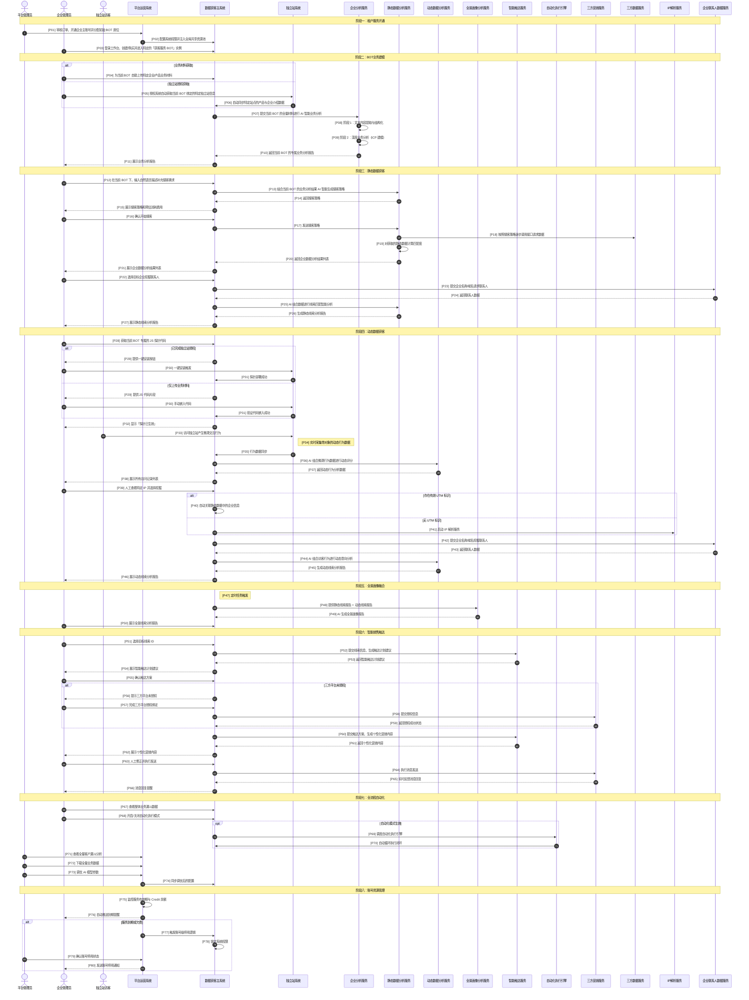

# 业务流设计

> **最后更新**：2026-04-20  
> **关联文档**：[01-概念设计](01-概念设计.md)、[02-商业化说明](02-商业化说明.md)、[03-角色组件设计](03-角色组件设计.md)、[04-实体关系设计](04-实体关系设计.md)

---

## 流程阶段划分

业务流程划分为以下8个阶段：

| 阶段 | 名称 | 阶段说明 |
|------|------|----------|
| 阶段一 | 租户服务开通 | 完成企业账号开通、初始资源分配 |
| 阶段二 | BOT业务建模 | 完成 BOT 业务材料上传与 AI 智能业务分析，建立 ICP 画像 |
| 阶段三 | 静态数据获客 | 基于 ICP 画像全网搜寻潜在客户，生成静态线索 |
| 阶段四 | 动态数据获客 | 独立站访客追踪，识别高意向 B2B 采购者，生成动态线索 |
| 阶段五 | 全景画像融合 | 关联静动态数据，生成企业全景画像 |
| 阶段六 | 智能销售触达 | 基于线索生成触达计划，执行智能触达 |
| 阶段七 | 全流程自动化 | 数据分析、模型调优、自动化控制 |
| 阶段八 | 账号资源管理 | 服务到期提醒、账号停用处理 |

---

## 阶段目标

| 阶段 | 名称 | 核心目标 |
|------|------|----------|
| 阶段一 | 租户服务开通 | 完成企业账号开通、初始资源分配 |
| 阶段二 | BOT业务建模 | 完成 BOT 业务材料上传与 AI 智能业务分析，建立 ICP 画像 |
| 阶段三 | 静态数据获客 | 基于 ICP 画像全网搜寻潜在客户，生成静态线索 |
| 阶段四 | 动态数据获客 | 独立站访客追踪，识别高意向 B2B 采购者，生成动态线索 |
| 阶段五 | 全景画像融合 | 关联静动态数据，生成企业全景画像 |
| 阶段六 | 智能销售触达 | 基于线索生成触达计划，执行智能触达 |
| 阶段七 | 全流程自动化 | 数据分析、模型调优、自动化控制 |
| 阶段八 | 账号资源管理 | 服务到期提醒、账号停用处理 |

---

## 阶段产出

| 阶段 | 名称 | 关键产出 |
|------|------|----------|
| 阶段一 | 租户服务开通 | 企业主账号、BOT 席位 |
| 阶段二 | BOT业务建模 | 业务分析报告、ICP 画像 |
| 阶段三 | 静态数据获客 | 静态线索池 |
| 阶段四 | 动态数据获客 | 动态线索池 |
| 阶段五 | 全景画像融合 | 全景画像线索池 |
| 阶段六 | 智能销售触达 | 触达记录、回复反馈 |
| 阶段七 | 全流程自动化 | 优化策略、自动化执行 |
| 阶段八 | 账号资源管理 | 账号状态管理 |

---

## 核心业务流程

### 阶段一：租户服务开通

| 步骤 | 动作 | 参与者 | 说明 |
|------|------|--------|------|
| P01 | 审核订单，开通企业主账号并分配初始 BOT 席位 | SAD | 平台管理员在 SYS 后台操作 |
| P02 | 配置系统权限并注入全局共享资源池 | 系统 | 注入 Global Credits 和 BOT Seats |
| P03 | 登录工作台，创建/购买并进入特定的「获客服务 BOT」实例 | EBA | 进入 BOT 工作空间 |

---

### 阶段二：BOT业务建模

| 步骤 | 动作 | 参与者 | 说明 |
|------|------|--------|------|
| P04 | 为当前 BOT 自助上传特定企业/产品业务材料 | EBA | 支持 PDF、PPTX、图片等格式 |
| P05 | 授权系统自动获取当前 BOT 绑定的特定独立站信息 | EBA | 独立站授权方式 |
| P06 | 自动同步特定站点的产品与企业介绍数据 | 系统 | 同步站点数据 |
| P07 | 提交当前 BOT 的全量材料进行 AI 智能业务分析 | 系统 | 启动异步分析任务 |
| P08 | 阶段 1：文本内容提取与结构化 | EAI | ETL 数据清洗 |
| P09 | 阶段 2：深度业务分析（ICP 建模） | EAI | 生成 ICP 画像和特征向量 |
| P10 | 返回当前 BOT 的专属业务分析报告 | 系统 | 分析完成 |
| P11 | 展示业务分析报告 | 系统 | 完成 BOT 初始化 |

---

### 阶段三：静态数据获客

| 步骤 | 动作 | 参与者 | 说明 |
|------|------|--------|------|
| P12 | 在当前 BOT 下，输入自然语言描述补充搜客需求 | EBA | 描述目标客户特征 |
| P13 | 结合当前 BOT 的业务分析结果 AI 智能生成搜客策略 | 系统 | 生成 API 调用计划 |
| P14 | 返回搜客策略 | 系统 | 包含预估消耗 |
| P15 | 展示搜客策略和预估消耗费用 | 系统 | 显示预估 Credits |
| P16 | 确认开始搜客 | EBA | 锁定预估 Credits |
| P17 | 发送搜客策略 | 系统 | 启动搜客任务 |
| P18 | 按照搜客策略逐步调用接口请求数据 | 系统 | 调用三方数据 API |
| P19 | 对获取的静态数据使用专属特征向量计算匹配度 | 系统 | 四维评分计算 |
| P20 | 返回企业数据分析结果列表 | 系统 | 包含匹配分数 |
| P21 | 展示企业数据分析结果列表 | 系统 | 展示搜客结果 |
| P22 | 选择目标企业挖掘联系人 | EBA | 消耗 Credits |
| P23 | 提交企业名称/域名请求联系人 | 系统 | 调用 Apollo API |
| P24 | 返回联系人数据 | 系统 | 包含邮箱、社媒等 |
| P25 | AI 结合企业静态数据与联系人数据进行线索匹配智能分析 | 系统 | 乘数提权计算 |
| P26 | 生成静态线索分析报告并进入当前 BOT 静态线索池 | 系统 | 线索入库 |
| P27 | 展示静态线索分析报告 | 系统 | 展示完整报告 |

---

### 阶段四：动态数据获客

| 步骤 | 动作 | 参与者 | 说明 |
|------|------|--------|------|
| P28 | 获取当前 BOT 专属的 JS 探针代码 | EBA | 准备部署探针 |
| P29 | 提供一键安装按钮或 JS 代码片段 | 系统 | 两种部署方式 |
| P30 | 一键安装触发或手动嵌入代码 | EBA | 部署探针 |
| P31 | 探针部署成功，回传站点验证状态 | 系统 | 验证部署 |
| P32 | 显示「探针已生效，等待数据回传」 | 系统 | 部署完成 |
| P33 | 访问独立站产生微观交互行为 | VST | 访客行为触发 |
| P34 | 实时采集带对象的动态行为数据 | 系统 | 采集行为+上下文 |
| P35 | 行为数据同步至数据获客主系统 | 系统 | 数据上报 |
| P36 | AI 结合微观行为数据进行动态评分并溯源历史行为 | 系统 | 行为意向分析 |
| P37 | 返回动态行为分析数据 | 系统 | 隔离存入访客表 |
| P38 | 展示所有访问记录列表 | 系统 | 访客行为分析看板 |
| P39 | 人工查看特定 IP 行为分析详情并选择挖掘 | EBA | 创建动态线索占位 |
| P40 | 自动关联当前 BOT 静态数据中已有的企业信息 | 系统 | UTM 标识关联 |
| P41 | 启动 IP 解析服务进行企业识别 | 系统 | 无 UTM 时调用 |
| P42 | 提交识别后的企业名称/域名挖掘联系人 | 系统 | 获取联系人 |
| P43 | 返回联系人数据 | 系统 | 联系人信息 |
| P44 | AI 结合访客行为与联系人数据进行动态意向智能分析 | 系统 | 乘数提权计算 |
| P45 | 更新状态，生成动态线索分析报告并正式进入动态线索池 | 系统 | 线索入库 |
| P46 | 列表跳转，展示动态线索分析报告 | 系统 | 展示完整报告 |

---

### 阶段五：全景画像融合

| 步骤 | 动作 | 参与者 | 说明 |
|------|------|--------|------|
| P47 | 定时任务触发：基于域名关联当前 BOT 内的静动态线索 | 系统 | 自动关联任务 |
| P48 | 提供静态线索报告 + 动态线索报告 | 系统 | 提交融合分析 |
| P49 | AI 生成全景画像报告并进入全景画像线索池 | 系统 | 生成综合报告 |
| P50 | 展示全景线索分析报告 | 系统 | 展示全景画像 |

---

### 阶段六：智能销售触达

| 步骤 | 动作 | 参与者 | 说明 |
|------|------|--------|------|
| P51 | 在当前 BOT 中选择目标线索 ID | EBA | 选择静态/动态/全景线索 |
| P52 | 提交线索报告信息，使用AI生成触达计划建议 | 系统 | 生成触达策略 |
| P53 | 返回智能触达计划建议 | 系统 | 包含建议渠道、联系人 |
| P54 | 展示智能触达计划建议 | 系统 | 展示触达计划 |
| P55 | 确认触达方案 | EBA | 确认联系人/渠道/语言/角色 |
| P56 | 提示三方平台未授权 | 系统 | 账号级共享验证 |
| P57 | 跳转至全局账号中心并完成三方平台授权绑定 | EBA | 所有 BOT 共享通道 |
| P58 | 提交授权信息并请求三方平台验证 | 系统 | 验证授权 |
| P59 | 返回授权成功状态 | 系统 | 授权完成 |
| P60 | 提交线索信息与触达方案设置，使用AI生成个性化营销内容 | 系统 | 生成内容 |
| P61 | 返回个性化营销内容 | 系统 | 开发信/社媒消息 |
| P62 | 展示个性化营销内容 | 系统 | 展示生成内容 |
| P63 | 人工修正确认个性化内容并执行发送 | EBA | 确认发送 |
| P64 | 通过全局授权的三方营销通道执行消息发送 | 系统 | 发送消息 |
| P65 | 实时反馈消息回复与响应结果 | 系统 | 监听回复 |
| P66 | 消息回复提醒与跟进通知 | 系统 | 归属至对应 BOT |

---

### 阶段七：全流程自动化

| 步骤 | 动作 | 参与者 | 说明 |
|------|------|--------|------|
| P67 | 在全局/单 BOT 看板查看整体业务漏斗数据对比 | EBA | 数据看板 |
| P68 | 针对特定 BOT 开启/关闭全流程自动化执行模式 | EBA | 自动化开关 |
| P69 | 根据开关状态调度自动化执行引擎 | 系统 | 调度自动化 |
| P70 | 在该 BOT 内自动循环执行搜客、分析、触达闭环 | 系统 | 自动执行 |
| P71 | 查看全量客户整体漏斗分析数据 | SAD | 平台级数据 |
| P72 | 下载全量业务数据表进行深度离线分析 | SAD | 数据导出 |
| P73 | 手动调优 AI 模型参数与提示词策略 | SAD | 模型优化 |
| P74 | 下发并同步调优后的模型配置 | 系统 | 配置同步 |

---

### 阶段八：账号资源管理

| 步骤 | 动作 | 参与者 | 说明 |
|------|------|--------|------|
| P75 | 监控服务有效期与全局 Credit 余额 | 系统 | 自动监控 |
| P76 | 自动推送服务到期/余额不足提醒 | 系统 | 提醒通知 |
| P77 | 触发账号级停用逻辑 | 系统 | 冻结名下所有 BOT |
| P78 | 锁定系统权限并保留数据状态 | 系统 | 数据保留 |
| P79 | 确认账号停用状态并记录原因 | SAD | 停用确认 |
| P80 | 发送账号停用通知 | 系统 | 停用通知 |

---

## 主流程时序图

