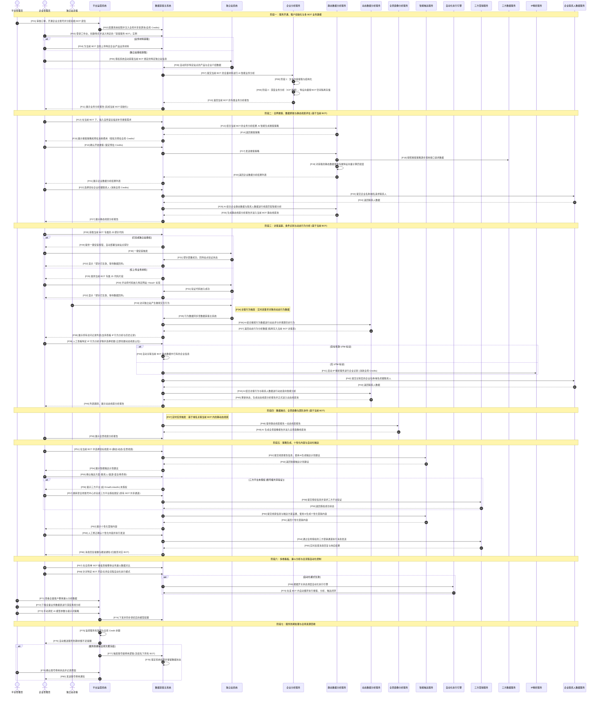

# 智能获客引擎(AI-LeadFinder) 核心业务流设计方案

## 目录
- [1. 角色与组件](#1-角色与组件)
- [2. 主流程图](#2-主流程图)

## 1. 角色与组件
## 参与角色 (Actors)

| 角色名称 | 缩写 (ID) | 职责描述 |
| :--- | :--- | :--- |
| 平台管理员 | SAD | 负责平台租户管理、权限配置、系统监控及模型和提示词维护。 |
| 企业管理员 | EBA | 负责配置企业业务信息、操作系统、获取线索。 |
| 独立站访客 | VST | 访问企业独立站，产生交互行为。 |

## 应用系统 (Application Systems)

| 系统名称 | 缩写 (ID) | 核心功能 |
| :--- | :--- | :--- |
| 平台运营系统（服务商系统） | SYS | 用于上架服务和定价，开通管理租户账号、配置权限和资源包。 |
| 数据获客主系统 | CLS | 提供搜索获客、访客雷达、企业配置、线索管理（静态线索、动态线索、全景线索）、消息推送、AI内容生成等功能。 |
| 独立站系统 | WBS | 获取访客流量、植入埋点代码、集成获客插件。 |

## 自有服务 (Internal Backend Services)

| 服务名称 | 缩写 (ID) | 核心功能 |
| :--- | :--- | :--- |
| 企业分析服务 | EAI | 对企业上传的材料/独立站授权的内容，进行业务分析，识别企业所处行业、产业上下游、潜在客户画像等。 |
| 静态数据分析服务 | SDA | 基于客户企业画像和输入要求提取搜索关键词，全网静态数据（海关数据、社媒数据、地图数据等）搜寻潜在的企业客户信息数据，进行清洗和结构化处理，并输出智能分析结果和匹配度评分的智能体。 |
| 动态数据分析服务 | DDA | 基于客户独立站植入的JS探针采集上报的数据（事件+上下文内容），从单流程行为、全流程行为、同IP的历史行为中提取有价值的信息，进行清晰和结构化处理，并输出智能分析结果和意向评分的智能体。 |
| 全景画像分析服务 | PPA | 自动从静态线索池和动态线索池，关联同企业域名的静态数据与动态数据，进行进一步的结合分析，生成企业全景画像分析报告和综合评分的智能体。 |
| 智能触达服务 | ITA | 根据选择的线索（静态线索、动态线索、全景线索）完整数据和信息，智能生成建议的触达计划。同时，支持根据确认后的触达计划，根据渠道、角色、语言等需求，智能生成个性化的开发信、推广消息等内容。 |
| 自动化执行引擎 | AEE | 负责根据配置的工作流，自动执行客户分析、数据搜客、数据分析、画像融合、智能触达等任务。 |

## 三方服务 (External Services)

| 服务名称 | 缩写 (ID) | 对接用途 |
| :--- | :--- | :--- |
| 三方营销服务 | TMP | 使用EMS/社媒消息进行触达。 |
| 三方数据服务 | TDS | 获取企业海关数据、社媒数据、地图数据等权威静态数据。 |
| IP解析服务 | IRS | 通过IP反查解析识别企业客户信息的三方服务 |
| 企业联系人数据服务 | ECS | 通过企业域名/名称获取企业关键联系人信息的三方服务 |

## 2. 主流程图
## 主流程时序图

